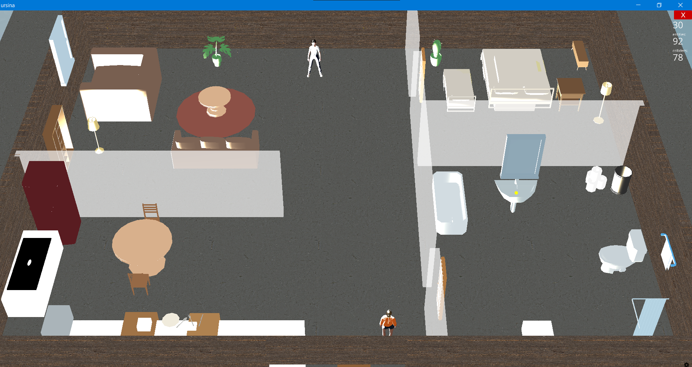
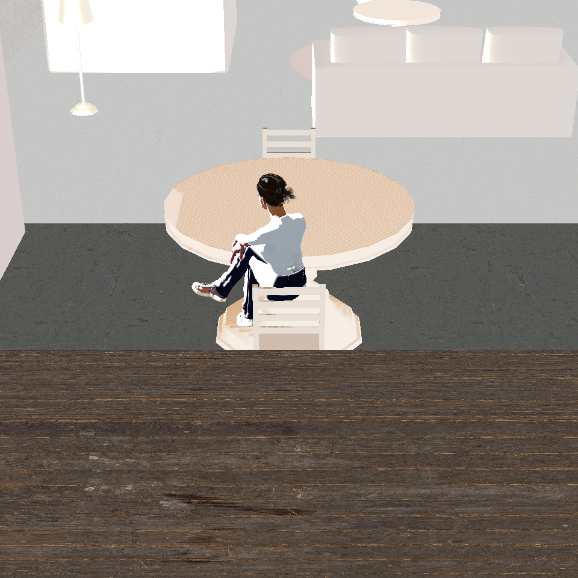
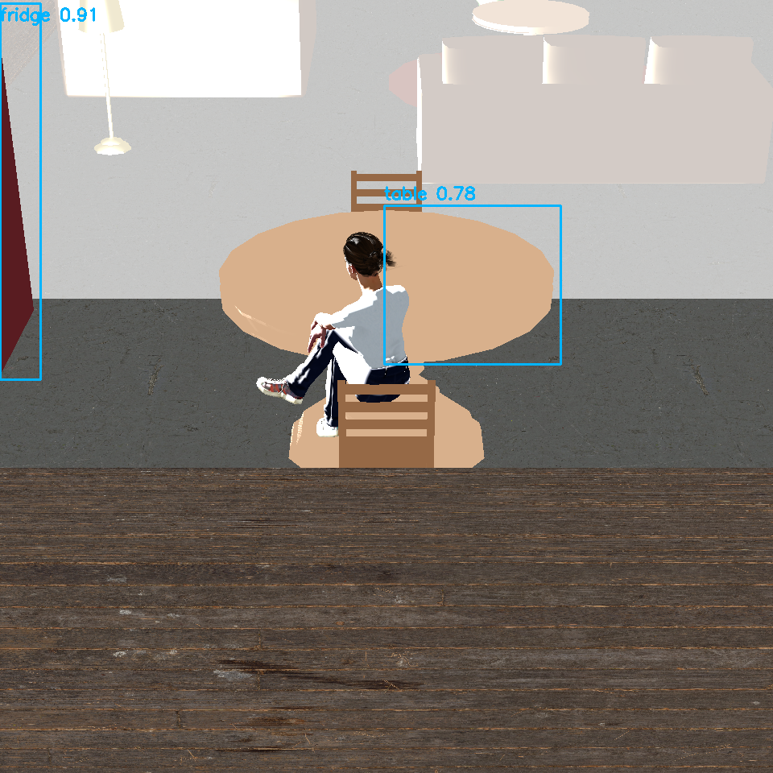

# 🏠 Smart Home Activity Analysis with 3D Digital Twin and YOLO

A thesis-oriented smart home digital twin project developed using Python, Ursina Engine, Panda3D, and YOLOv8.

This project creates a fully interactive 3D smart home environment where virtual humans perform daily activities while the system detects rooms, objects, and activities using computer vision techniques.

---

## 📌 Project Overview

The main purpose of this project is to simulate a realistic smart home environment without requiring physical IoT sensors.

The system includes:

- A fully modeled 3D smart house
- Interactive smart devices
- Virtual human behaviors and animations
- Real-time event logging
- Computer vision analysis with YOLO
- Activity understanding based on room and object context
- Synthetic dataset generation for AI training

This project aims to demonstrate how a digital twin architecture can be used for smart home activity analysis and artificial intelligence research.

---

## 🖼️ Project Screenshots

### General Smart Home Layout



### 3D Smart Home Activity View



### YOLO Object Detection and Activity Analysis



---

## 🎯 Main Objectives

✅ Create a realistic virtual smart home environment

✅ Simulate human daily activities and interactions

✅ Detect people and household objects using YOLO

✅ Analyze activities based on detected objects and room information

✅ Generate structured event datasets automatically

✅ Build a synthetic dataset generation pipeline

✅ Develop a digital twin system for smart home research

---

## 🏡 3D Smart Home Environment

The virtual house contains multiple rooms:

- Kitchen
- Living Room
- Bedroom
- Bathroom
- Hallway

The environment includes realistic household objects such as:

- Beds
- Tables
- Chairs
- Couch
- Lamps
- Fridge
- Sink
- Cabinets
- Toilet
- Bathtub
- Doors
- Plants
- Shelves

The environment was developed using Ursina Engine and Panda3D.

---

## 👤 Virtual Human Simulation

Two controllable virtual humans are integrated into the environment:

- Megan
- Sophie

Supported animations include:

- Walking
- Sitting
- Lying down
- Sleeping
- Standing up

The characters can freely move around the house and interact with smart devices and furniture.

---

## ⚡ Smart Device System

Interactive smart devices were implemented with state tracking and event logging.

Implemented devices include:

- Smart doors
- Kitchen outlet system
- Toaster
- Coffee machine
- Oven
- Lamps
- Sink

Example logic rules:

- The toaster cannot operate unless the outlet is ON
- Coffee machine requires electricity
- Device state transitions are tracked automatically

---

## 📊 Event Logging System

All interactions inside the smart home are automatically stored in CSV format.

Logged events include:

- Room transitions
- Device interactions
- Sitting and sleeping activities
- Vision detections
- Human movement tracking
- Activity recognition results

Example event log:

```csv
timestamp,actor_id,room_name,event_code,event_message
2026-05-07,A,Kitchen,sit_idle_started,A is now seated
2026-05-07,B,Bedroom,vision_activity_detected_b,Activity detected: lying_on_bed
```

## 🎮 Controls

| Key | Action |
| --- | --- |
| W / A / S / D | Move Character A |
| Arrow Keys | Move Character B |
| E | Interact with nearest smart device |
| Q | Sit / Stand |
| F | Lie Down / Get Up |
| T | Print vision camera positions |

---

## 🚀 How to Run

### 1. Clone the Repository

```bash
git clone <repository-url>
cd smart-home-activity-analysis
```

### 2. Create and Activate Virtual Environment

```bash
python -m venv venv
venv\Scripts\activate
```

### 3. Install Dependencies

```bash
pip install -r requirements.txt
```

### 4. Run the 3D Smart Home Simulation

```bash
python src/SmartHome3D/main_3d_house.py
```
